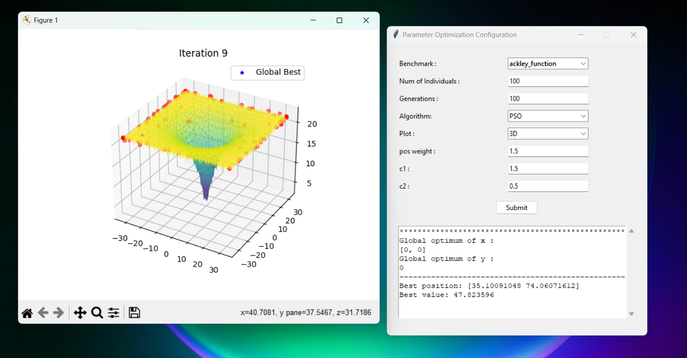
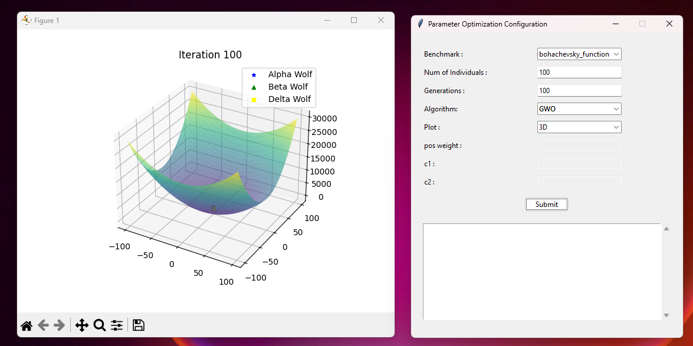

# Function Optimization with PSO and GWO Visualization

## Overview
This project is dedicated to optimizing benchmark functions like Bohachevsky, Ackley, Schwefel, and Himmelblau using Evolutionary Algorithms (EAs), specifically Particle Swarm Optimization (PSO) and Grey Wolf Optimization (GWO). It features a GUI for visualizing the optimization process in both 2D and 3D, allowing users to interactively choose variables and observe algorithm performance.

## Features
- **Optimization**: Utilizes PSO and GWO for function optimization.
- **Visualization**: Offers 2D and 3D visualization of the optimization process.
- **Benchmark Functions**: Includes Bohachevsky, Ackley, Schwefel, and Himmelblau functions.
- **Interactive GUI**: Built with Tkinter for a user-friendly experience to make it easy to visualize the movement of particles.

## How to Use
1. Install dependencies: `pip install numpy matplotlib`
2. Run the GUI: `python swarm/UI.py`
3. Select the algorithm (PSO/GWO) and function.
4. Set algorithm parameters (particles, iterations, etc.).
5. Visualize and analyze the optimization process.

## Files

- `Comparing_algorithms.py`: the main file to get the difference between 2 algorithms considering iterations and best fitness value.
- `PSO_algorithm.py`: the main code of the Particle swarm optimization algorithm.
- `GWO_algorithm.py`: the main code of the Grey Wolf Optimizer algorithm.
- `PSO_animated.py`: PSO implementation with animation and visualization of the plot in 3d and 2d perspective.
- `GWO_animated.py`: GWO implementation with animation and visualization of the plot in 3d and 2d perspective.
- `Common_libs.py`: Shared utilities for PSO and GWO.

## Usage
Follow the GUI instructions to run PSO and GWO algorithms, adjust parameters, and visualize the optimization in real-time.

## Benchmark Functions
Supported functions:
- **Bohachevsky Function**:

$$
f(x, y) = x^2 + 2y^2 - 0.3\cos(3\pi x) - 0.4\cos(4\pi y) + 0.7
$$

- **Ackley Function**:

$$
f(x, y) = -20\exp\left(-0.2\sqrt{0.5(x^2 + y^2)}\right) - \exp\left(0.5(\cos(2\pi x) + \cos(2\pi y))\right) + e + 20
$$

- **Schwefel Function**:

$$
f(x) = 418.9829d - \sum_{i=1}^{d} x_i\sin(\sqrt{|x_i|})
$$

- **Himmelblau Function**:

$$
f(x, y) = (x^2 + y - 11)^2 + (x + y^2 - 7)^2
$$

## Dependencies
- **NumPy**: For numerical computations.
- **Matplotlib**: For creating visualizations.
- **Python**: the main programming language algorithms implemented with it.

## Acknowledgments
This project is inspired by the extensive research in Swarm Intelligence and optimization algorithms.

## Contributing
Contributions are welcome! Please read the contributing guidelines to get started.

## References
- [Particle Swarm Optimization](https://machinelearningmastery.com/a-gentle-introduction-to-particle-swarm-optimization/)
- [Grey Wolf Optimization](https://seyedalimirjalili.com/gwo)
- [Optimization Test Problems / Functions](https://www.sfu.ca/~ssurjano/optimization.html)
